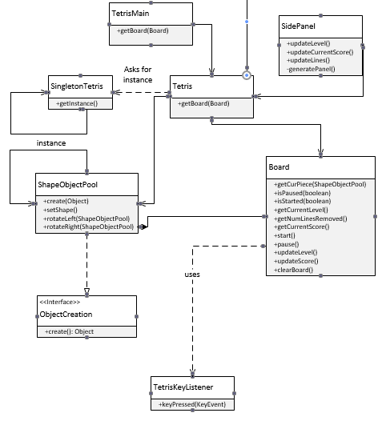

# The Game Hub using java

# INTRODUCTION
The Game Hub is a platform that enables users to choose from a number
of games according to their choice and liking. The gaming hub was
designed with the sole purpose of entertainment to our users. The reason
why we chose this topic is because we wanted to come up with something
interesting and appealing to our audience. The first question we asked
ourselves is “What will our audience relate to more” given the current
situation and environment we are in, and only one answer came to our
minds i.e. “Games”. During this pandemic, if there is one thing we have
started to spend more time on, then that is our phones. Browsing through
instagram, watching youtube videos and playing online games. We realized
a lot of people are keeping their sanity by entertaining themselves by
playing games or doing mind stimulating activities. This is the biggest
reason why we chose The Game Hub as our project. Another reason why
we wanted to design a game hub is because we wanted to do a
“Throwback to the 90’s” theme games. We wanted to feed into the
nostalgic effect by playing games such as “Snake” and “Minesweeper”.
After all, who doesn't remember playing the Snake game on those old
Nokia phones, or playing Minesweeper on those old Windows 7 PC’s.
The Game Hub consists of 5 different types of games. Each of these
games are driven by differing factors to win. For example, some games
have an objective to finish, whereas the other games are mostly “Beat your
own high score” kind of games. The Game Hub consists of the following 5
games namely: Tetris, Minesweeper, Cross-circles, Snake game and
Cannon Simulator. This Game hub is mostly targeted at college going
students or older. Since, this game is more appealing to the kids born in the
90’s or before, we believe that the kids born post 2000’s won’t understand
the nostalgic effect behind the game hub. However, due to how easy these
games are, we believe that anyone will be able to play them easily and will
have a good time doing so.

# SYSTEM DESIGN
Our system is a gaming hub that consists of a GUI that contains the
combination of five different games. The games are implemented using
java swing which is an API for producing a graphical user interface. This
was done so as to create five buttons that instantiate five different games.
We made sure that the proper game was instantiated upon clicking of that
button.
The Game Hub system was designed with the help of the following four
design patterns:

Object Pool Design Pattern.
Snapshot Design Pattern.
Singleton Design Pattern.
Builder Design Pattern.
State Design Pattern.
Let us begin with the explanation of each design pattern and how and why
it was implemented in our system.

1. Object Pool Design Pattern

This design pattern helped us in the creation of the shape of the objects in
the tetris game. The reason we used the reusable object pool design
pattern is that we wanted to reuse the same object over and over again, as
opposed to creating an object on demand and then destroying it and going
through this process over and over again. If we were to continue with this
process, we would have a serious performance issue and be extremely
expensive. The Object Pool can manage the connections and provide a
way to reuse and share them and this creates a huge performance boost.
In ShapeObjectPool. We have multiple shapes like pShape, zShape,
mirrorShape, etc. We want to be able to call and reuse these shapes over
and over again without having to recreate and destroy them.

2. Snapshot Design Pattern

The Snapshot or the Memento Design pattern was
implemented in our minesweeper and our Cross Circles game.
This was done for the purpose of restoring the object to the
previous state. ​The reason we have used this design pattern in
the Cross & Circles game is so that we can undo our actions.
ANd the reason we used it in minesweeper is so we could
restart the game and go back to the initial state again, so in a
way we “restore” our first state.​ The memento design pattern is
implemented with three objects: CellOriginator, GameCaretaker
and ScoreSnapshot which acts as the ScoreMemento.

3. Singleton Design Pattern

The reason we used singleton design pattern is because we want the
object to instantiate only one game at a time. Since we have five games in
our game hub, we want just one game to get instantiated upon clicking the
button of that respective game. We also wanted to make sure that upon
clicking we want the single object to get instantiated just once. Whenever a
user clicks on a game, only that game must
be instantiated. This is the reason why we made use of the singleton
design pattern.

4. Builder Design Pattern

We used Builder design pattern to change the color of Cannon Ball for the
Cannon Simulator. The reason for using the Builder design pattern is so as
to be able to hide the constructive complexity of the game from its
representation. We can make different objects using this one particular
code. In our case, our Product is a ConcreteBall, and we can change the
color of that ball as we please.

5. State Design Pattern

We have implemented the state design pattern in our Snake Game. The
reason we used this design pattern is so that we can alter its behaviour
when the internal state of the game changes like when the snake eats food,
we want the size of the snake to change that is it will change its state. This
is why we utilized the state design pattern. The other reason for using the
state design pattern is for spawning of the food in random locations.

# SYSTEM IMPLEMENTATION
In each of the games that we have implemented, we made sure they
all possess a unique set of features that make them enjoyable and
fun to play. Here are the games along with their features and
screenshots:
Tetris

Fig 1.1 The before image for Tetris

Fig 1.2 The after image for Tetris

Tetris is a tile matching game that plays with the idea of matching multiple
objects of various shapes to combine and form a line so as to clear the
lines and increase the level of the player. The features offered by our tetris
game are as follows:
● Able to change the shape of the tiles by pressing the Up and Down
arrow key.
● Ability to soft drop by pressing the D key.
● Ability to do a hard drop by pressing the spacebar.
● Ability to increase the “Lines cleared section” whenever a line gets
cleared due to matching of puzzle pieces.
● Ability to Pause the game as per users choice.

Minesweeper

Figure 2.1 The before image for minesweeper

Figure 2.2 The after image for minesweeper

The minesweeper is a simple puzzle game wherein you are supposed to
clear the rectangular board without detonating any hidden mines or bombs.
The features of this game include:
● Ability to right click on a particular tile and “red flag” it.
● Ability to check the amount of games you have played.
● Ability to check the win percentage.
● Ability to check the amount of games won.
● Ability to check the amount of games lost.
● Ability to reset the counter.
● Ability to check the highest winning streak.

Cross-Circle

Figure 3.1 The before image for Cross & Circles

Figure 3.2 The after image for cross & circles
Cross & Circle is our normal Tic-Tac-Toe game with just a fancier name. It
also goes by the name “ X and O’s ”. This is one of our favourite, most
nostalgia inducing games.
The features of the Cross and Circles game are as follows:
● This is a multiplayer game.
● Players are able to undo their actions.
● Users are able to play again by clicking on a button.

Snake game

Figure 4.1 The before image for snake game

Figure 4.2 The after image for snake game

The Snake game was the game we all used to play on our old Nokia
phones. The snake game is the game wherein the player maneuvers a line
that grows in length as the snake consumes more food.
The features of the snake game are as follows:
● The snake is able to surpass the boundaries and re-enter from the
other side.
● The snake is able to increase in size upon consumption of food.
● The food is generated at random locations.
● Ability to end the game when the snake touches its own tail.

Cannon Simulator

Figure 5.1 The before image for cannon simulator

Figure 5.2 The after image for cannon simulator

The Cannon Simulator is a simulation game wherein you can shoot
various cannons into the air. A simulation game is a type of video
game that is designed to closely simulate real world activities.
The features of the Cannon Simulator are as follows:
● Able to shoot cannons of various colors in the air.
● Able to change the angle of the cannon shooter.
● Ability to change the Size of the cannons.
● Ability to change the power (strength) of the cannon being
pushed into the air.

# LESSONS LEARNED
Due to the implementation of this project, we learned the benefits of using
design patterns. Design patterns help the system become easier to
implement and maintain. Using design patterns, we learnt to target very
specific particular problems. We learned about all the design patterns
taught in class and learned to map them to our games and see which one
would be a better fit for the game features.

We learned about the differences in each design pattern. We learnt each
design pattern's implications, drawbacks and benefits. While implementing
these design patterns we learned about the way to go about while
implementing these design patterns.

The implementation of this project helped us learn how to implement
various design patterns. While implementing design patterns we had an
opportunity to understand the design patterns in my depth and detail. One
of the lessons we learnt is to use source control more often. Another lesson
we learnt is to name our labs and project versions with updated version
names. We faced a lot of confusion because of not naming the versions
with appropriate updated names.
